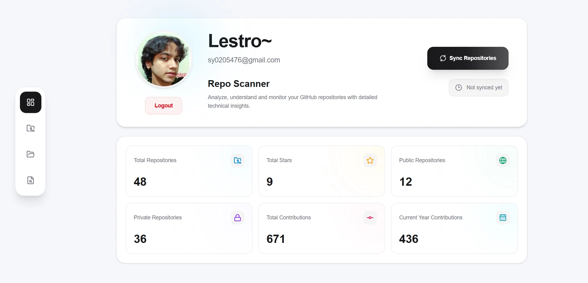
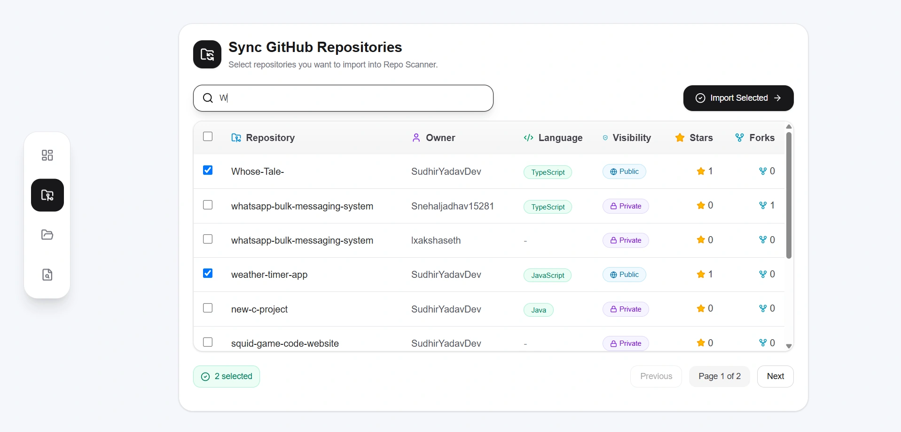
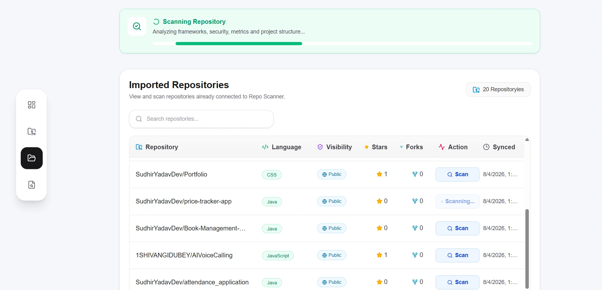
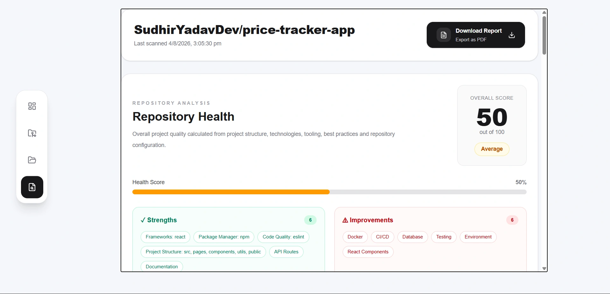

# Repo Scanner 🚀

A GitHub repository analysis platform that automatically scans repositories, detects technologies, analyzes security risks, and generates engineering reports.

🔗 **Live :** https://repo-scanner-iota.vercel.app

---

## 📌 Overview

Repo Scanner helps developers understand their codebases faster by providing automated repository insights.

Connect your GitHub account, select repositories, and get detailed analysis including:

- Repository health score
- Technology detection
- Security analysis
- Engineering setup insights
- Repository metrics
- File distribution reports

---

## ✨ Features

### 🔍 Repository Analysis
- Import GitHub repositories
- Select specific repositories to analyze
- Scan repository structure and files
- Detect frameworks, databases, package managers, and tools

### 🛡️ Security Analysis
- Static security scanning
- Detect potential security issues
- Categorize vulnerabilities by severity

### 📊 Engineering Reports
- Repository health scoring
- Technology breakdown
- Code structure insights
- Downloadable PDF reports

### 📈 Dashboard
- Repository overview
- Imported repository management
- Scan history and reports

---

## 🖥️ Screenshots

### Dashboard



---

### Repository Selection



---

### Imported Repositories



---

### Repository Report



---

## 🛠️ Tech Stack

### Frontend
- Next.js
- React
- TypeScript
- Tailwind CSS

### Backend / Database
- Next.js Server Actions
- Prisma ORM
- PostgreSQL

### Authentication
- GitHub OAuth
- Better Auth

### Other Tools
- GitHub API
- PDF Report Generation

---

## ⚙️ Running Locally

Clone the repository:

```bash
git clone https://github.com/your-username/repo-scanner.git
```

Navigate into the project:

```bash
cd repo-scanner
```

Install dependencies:

```bash
npm install
```

Create a `.env` file:

```env
DATABASE_URL=
GITHUB_CLIENT_ID=
GITHUB_CLIENT_SECRET=
```

Run database migrations:

```bash
npx prisma migrate dev
```

Start the development server:

```bash
npm run dev
```

Open:

```
http://localhost:3000
```

---

## 📂 Project Structure

```
src
├── app
├── components
├── features
│   └── repositories
├── lib
└── utils
```

---

## 🎯 Purpose

Repo Scanner was built to simplify understanding large codebases by automatically collecting important repository information and presenting it in a clean engineering-focused dashboard.

---

⭐ If you find this project useful, consider giving it a star!